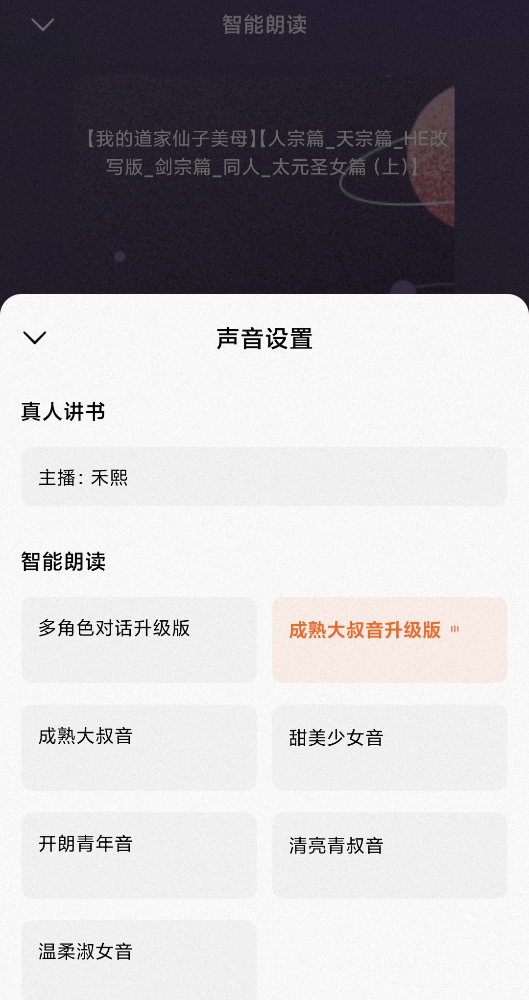

# 🍅 番茄Show (TomatoRead)

> 番茄小说「智能朗读」音色解锁模块 · LSPosed / Xposed

**实现了番茄小说本地书籍加载付费在线 AI 音色** —— 让本地书籍也能使用「多角色对话升级版」「成熟大叔音升级版」等优质付费在线 AI 音色，解锁智能朗读的完整体验。

---

## ✨ 功能特性

- 🎙️ **本地书籍解锁付费在线 AI 音色**
  本地书/成绩不达标图书的智能朗读音色面板，直接展示并加载「多角色对话升级版」「成熟大叔音升级版」「开朗青年音」「甜美少女音」等在线 AI 音色。
- 📖 **在线书籍多角色音色**
  支持 TTS 在线书籍选择「多角色对话升级版」（97）音色，UI 展示、选择存储、播放校验全链路打通。
- 🎧 **流式 TTS 修复**
  本地书籍 bookId 溢出修正，streamtts 流式请求正常下发音频。
- 📝 **字幕修复**
  修复智能朗读字幕加载卡死/一直加载中的问题。
- 🔄 **在线更新提醒**
  主界面集成 GitHub Releases 在线更新检测，有新版本自动弹窗提示，一键跳转下载。
- 📱 **主界面**
  版本号 / 功能清单 / 日志路径 / 作者联系方式。

## 🛠️ 使用说明

1. 安装 [LSPosed](https://github.com/LSPosed/LSPosed) 框架（或兼容 Xposed 环境）
2. 安装本模块 APK（从 [Releases](https://github.com/giaoimgiao/tomato-read/releases) 下载最新版）
3. 在 LSPosed 中启用模块，作用域勾选 **番茄小说**（com.dragon.read）
4. **重启** 使模块生效
5. 打开番茄小说 → 任意书籍 → 智能朗读 → 音色面板，选择 AI 音色即可

## 🔧 技术实现

基于 Xposed hook 拦截番茄小说音色链路，核心 hook 点：

| 层级 | Hook 点 | 作用 |
|---|---|---|
| UI 展示 | `LocalBookOfflineTts$a.a()` / `BookToneInfo` | 强制开启 AI 音色展示位，注入 AI 音色列表 |
| 音色列表 | `w02/g.I(AudioPageInfo)` | 本地书注入全量 AI 音色；TTS 书追加 97 多角色 |
| 播放校验 | `w02/g.x(AudioCatalog)` | 向播放引擎的 speakerList 数据源追加多角色音色 |
| 权威数据源 | `AudioConfigApi.P()` | 全局 AI 音色列表补全（97/91/74/4/1/5/2/6） |
| 播放放行 | `dialog/f.s0(AudioPageInfo)` | AI tab 播放前校验强制放行 |
| 流式请求 | `repo/d.a()` / `InnerSegmentRepo` | bookId=0 修正为 itemId，streamtts 服务端正常返回音频 |
| 字幕链路 | `SubtitleListProvider.c()` / `TTSSubtitleProvider.g()` | 短路加载失败态，主动回调空字幕收尾 |

音色 ID 说明：
- **97** = 多角色对话升级版（在线书真 ID，is_multi_tone=true, parent_tone_id=51）
- **74** = 成熟大叔音升级版
- **91** = 本地书同名伪 ID（服务端不生成音频）

## 📜 更新日志

- **v2.5.8** 正式版：日志白名单过滤（移除 CRONET/RPC/PARSE 调试输出），全自动 GitHub Release 发布链路
- **v2.5.7** 修复播放校验：hook `w02/g.x(AudioCatalog)` 向播放引擎 speakerList 注入多角色音色
- **v2.5.6** 正式版：`AudioConfigApi.P()` 全局列表注入 97 + 主界面 QQ/在线更新 + Release 发布
- **v2.5.5** 在线书 UI：TTS 书走 `w02/g.I` → `x(catalog)` 链路，追加 97 多角色
- **v2.5.4** 在线书数据层：`BookToneInfo.ttsTones` 注入 97
- **v2.5.3** 流式请求体对比：多角色本地书 = 服务端按音色 ID 硬限制（结案）
- **v2.5** 字幕链路：短路 ASR/TTS 同步，主动回调空字幕
- **v2.4** 流式 TTS：bookId=0 改为 itemId，服务端接受返回 200
- **v2.0** 播放前拦截：`w02/g.I` 注入 + `dialog/f.s0` 强制放行
- **v1.6** UI 展示：`LocalBookOfflineTts$a.a()` 强制 showAiTone + 注入 `LocalPageInfoRepo.X()`

## ⚠️ 声明

本模块仅供学习交流使用，请勿用于商业用途。使用本模块产生的任何后果由使用者自行承担。

## 👤 作者

有问题或建议请联系 QQ：**3519425997**
